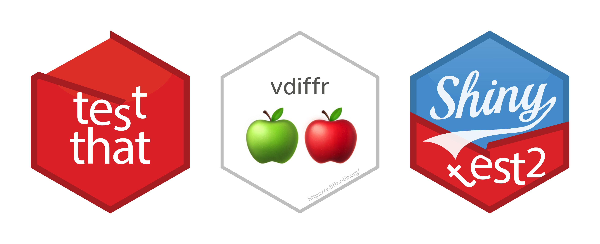

# Introduction to snapshot (aka golden) testing (in R)

In this presentation, I introduce what is snapshot testing, why is it
necessary, and its implementation in R in `{testthat}` package and its
extensions.



In particular, the presentation provides a detailed account of how these
tests are valuable in testing:

- text outputs
- graphical outputs
- Shiny apps
- entire files

Slides can be seen here:
<https://www.indrapatil.com/intro-to-snapshot-testing/>

## Development

This project uses R 4.6.0 or later (declared in `DESCRIPTION`), [Quarto](https://quarto.org/) for rendering slides, and [just](https://github.com/casey/just) as a command runner.

### Prerequisites

```bash
# Install just (macOS)
brew install just
```

### Setup

```bash
just install
```

### Just Commands

```bash
just help     # Show all available commands
just install  # Install R dependencies from DESCRIPTION
just render   # Render slides to HTML
just preview  # Start a live preview with auto-reload
just open     # Open rendered slides in the default browser
just clean    # Remove generated files and caches
just check    # Check the Quarto and R version setup
just          # Install dependencies, render, and open slides
```

## Feedback

Feedback and suggestions are welcome in [the issue tracker](https://github.com/IndrajeetPatil/intro-to-snapshot-testing/issues).
