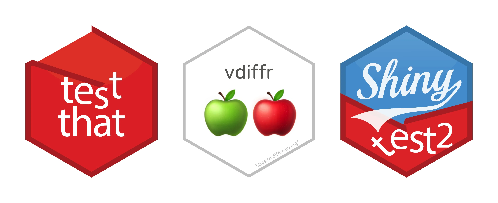

# Introduction to snapshot (aka golden) testing (in R)

[](https://github.com/IndrajeetPatil/intro-to-snapshot-testing/actions/workflows/build-presentation.yaml)

In this presentation, I introduce what is snapshot testing, why is it
necessary, and its implementation in R in `{testthat}` package and its
extensions.



In particular, the presentation provides a detailed account of how these
tests are valuable in testing:

- text outputs
- graphical outputs
- Shiny apps
- entire files

Slides can be seen here:
<https://www.indrapatil.com/intro-to-snapshot-testing/>

## Development

This project uses R 4.6.0 or later (declared in `DESCRIPTION`), [Quarto](https://quarto.org/) for rendering slides, and [just](https://github.com/casey/just) as a command runner.

### Prerequisites

```bash
# Install just (macOS)
brew install just
```

### Setup

```bash
just install
```

### Just Commands

```bash
just help     # Show all available commands
just install  # Install R dependencies and the a11y extension
just sync     # Alias for install
just update   # Update R dependencies
just render   # Render slides to HTML
just preview  # Start a live preview with auto-reload
just open     # Alias for preview (live-reload dev server over localhost)
just clean    # Remove generated files and caches
just check    # Check the Quarto and R version setup
just axe      # Preview with an Accessibility Report slide
just          # Install dependencies and start live-reload preview
```

`just axe` enables the opt-in `a11y` profile. It accepts preview options, for example `just axe --no-browser --port 8834`. Inspect slide and scroll views, including all fragments and tab panels. Run `just render` for the production deck, which excludes the audit payload and report.

### Accessibility

`just install` and the shared CI workflow install the latest
[`quarto-revealjs-a11y`](https://github.com/mcanouil/quarto-revealjs-a11y) directly
from upstream with `quarto add mcanouil/quarto-revealjs-a11y --no-prompt`.
The extension handles browser zoom, slide isolation, focus indicators, link
underlines, reduced motion, and screen-reader announcements.

The `accessibility.html` helper still handles scrollable code, slide-menu focus,
and vertical-slide semantics. Tab ordering and arrow-key navigation remain for this deck's tabset.
The extension's slide-menu patch and accessibility settings panel are disabled
as in the reference deck: version 0.2.3 introduces ARIA and contrast failures in
those components.

Use `just axe` to inspect slides, fragments, and menu panels in presentation and
scroll views. Normal builds omit the axe checker.

## Feedback

Feedback and suggestions are welcome in [the issue tracker](https://github.com/IndrajeetPatil/intro-to-snapshot-testing/issues).
